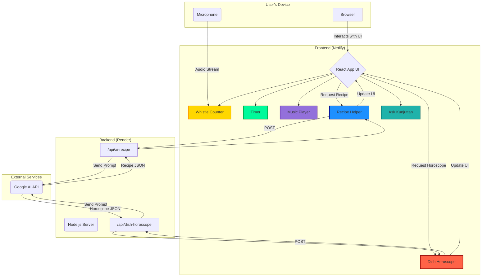

# Cook N Count 🎯


## Basic Details
### Team Name: Void


### Team Members
- Team Lead: Mihikka S - NSS College of Engineering Palakkad
- Member 2: Vishnu M - NSS College of Engineering Palakkad

### Project Description
Level up your cooking with Cook'n'Count, your pixel kitchen assistant! It automatically counts cooker whistles, runs perfect timers, and generates AI-powered recipes when you're out of ideas. Discover your "personality dish" with our fun food horoscope, chill out with retro chiptunes from the music player, and get instant advice from our friendly AI chef, "Kunjuttan."

### The Problem (that doesn't exist)
Ever forgot how many whistles your cooker made while you were busy scrolling memes?
Or maybe you can’t tell if your rice is ready because you were too busy whistling along?
Exactly. We’re here to solve this non-problem for you.

### The Solution (that nobody asked for)
We gave your cooker super-hearing.
Our app listens for whistles, counts them, shows a pixel cooker shaking in excitement, and Kunjuttan tells you whether your chicken curry still needs “one more toot” or not.
Oh, and there’s an alarm — because the rice won’t text you when it’s done.

## Technical Details
### Technologies/Components Used
For Software:
-Languages: HTML, TypeScript, CSS

-Frameworks: React.js (for UI), Vite (for bundling)

-Libraries: Web Audio API (whistle detection), TensorFlow.js (sound classification), GSAP (pixel animations)

-Tools: Figma (pixel UI design), GitHub (version control)


### Implementation
For Software:
# Installation
```js
npm install
```

# Run
```js
npm run dev
```

### Project Documentation
For Software:

# Screenshots (Add at least 3)

*Add caption explaining what this shows*


*Add caption explaining what this shows*


*Add caption explaining what this shows*

# Diagrams

For Hardware:

# Schematic & Circuit

*Add caption explaining connections*


*Add caption explaining the schematic*

# Build Photos

*List out all components shown*


*Explain the build steps*


*Explain the final build*

### Project Demo
# Video
[Add your demo video link here]
*Explain what the video demonstrates*

# Additional Demos
[Add any extra demo materials/links]


---
Made with ❤️ at TinkerHub Useless Projects 


